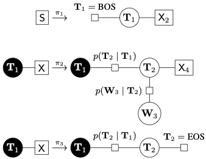

# fggs: Factor Graph Grammars in Python

Factor graph grammars (FGGs) are hyperedge replacement graph grammars for factor graphs. They generate sets of factor graphs and can describe a more general class of models than plate notation and many other formalisms can. Moreover, inference can be done on FGGs without enumerating all the generated factor graphs.

This library implements FGGs in Python and is compatible with PyTorch (tested with Python >= 3.7 and PyTorch >= 3.8).

FGGs are described in the following paper:

David Chiang and Darcey Riley. [Factor graph grammars.](https://arxiv.org/abs/2010.12048) In Proc. NeurIPS. 2020.

This code is written by David Chiang, Darcey Riley, and Ken Sible, at the University of Notre Dame, and is licensed under the MIT License.

## Installing

Run `pip install fggs`.

## Using

See `examples/parser/parser.py` for an example of using the package to
train a simple FGG.

### Creating an FGG

The FGG paper has an example of an FGG for a hidden Markov Model:

To reproduce this example, first create the FGG object, with start symbol `S`:

    fgg = fggs.FGG('S')

Next, we create an empty right-hand side for rule π₁:

    rhs = fggs.Graph()

Create a node labeled `'T'` and call it `v1`:

    v1 = rhs.new_node('T')

Create a terminal edge labeled `'is_bos'` and a nonterminal edge labeled `'X'`:

    rhs.new_edge('is_bos', [v1], is_terminal=True)
    rhs.new_edge('X', [v1], is_nonterminal=True)

Finally, create the rule with left-hand side `'S'` and rhs `rhs`:

    fgg.new_rule('S', rhs)

Similarly for rules π₂ and π₃. The only thing new about these rules is
that their right-hand sides have external nodes, which need to be set.

    rhs = fggs.Graph()
    v1, v2, v3 = rhs.new_node('T'), rhs.new_node('T'), rhs.new_node('W')
    rhs.new_edge('transition', [v1, v2], is_terminal=True)
    rhs.new_edge('observation', [v2, v3], is_terminal=True)
    rhs.new_edge('X', [v2], is_nonterminal=True)
    rhs.ext = [v1]
    fgg.new_rule('X', rhs)
    
    rhs = fggs.Graph()
    v1, v2 = rhs.new_node('T'), rhs.new_node('T')
    rhs.new_edge('transition', [v1, v2], is_terminal=True)
    rhs.new_edge('is_eos', [v2], is_terminal=True)
    rhs.ext = [v1]
    fgg.new_rule('X', rhs)

The last step is to create the domains and factors. For the domains,
we list out the possible values:

    fgg.new_finite_domain('T', ['BOS', 'EOS', 'IN', 'NNS', 'VBP'])
    fgg.new_finite_domain('W', ['cats', 'chase', 'dogs', 'that'])

And for the factors, we provide weight tensors:

    fgg.new_finite_factor('is_bos', torch.tensor([1.0, 0.0, 0.0, 0.0, 0.0]))
    fgg.new_finite_factor('is_eos', torch.tensor([0.0, 1.0, 0.0, 0.0, 0.0]))
    fgg.new_finite_factor('transition',
        torch.tensor([
            [0.0, 0.0, 0.0, 1.0, 0.0], # BOS
            [0.0, 0.0, 0.0, 0.0, 0.0], # EOS
            [0.0, 0.0, 0.0, 0.0, 1.0], # IN
            [0.0, 0.5, 0.5, 0.0, 0.0], # NNS
            [0.0, 0.0, 0.0, 1.0, 0.0], # VBP
        ])
    )
    fgg.new_finite_factor('observation',
        torch.tensor([
            [0.0, 0.0, 0.0, 0.0], # BOS
            [0.0, 0.0, 0.0, 0.0], # EOS
            [0.0, 0.0, 0.0, 1.0], # IN
            [0.5, 0.0, 0.5, 0.0], # NNS
            [0.0, 1.0, 0.0, 0.0], # VBP
        ])
    )

Use `fgg_to_json(fgg)` to convert FGG `fgg` to an object writable by
`json.dump`, and `json_to_fgg(json)` to convert an object read by
`json.load` to an FGG.

### Factorization

The function `fggs.factorize_fgg(fgg)` factorizes an FGG's rules into
possibly smaller rules, making sum-product computations more
efficient. This function takes an optional argument:

- `method`
  * `"min_fill"`: fast approximate method (default)
  * `"quickbb"`: partial implementation of Gogate and Richter's QuickBB
  * `"acb"`: slow exact method of Arborg, Corneil, and Proskurowski

### Sum-products

The function `fggs.sum_product(fgg, **opts)` computes the sum-product
of an FGG with finite domains and factors. It has a lot of options:

- `method`
  * `"fixed-point"`: fixed-point iteration (default)
  * `"linear"`: linear solver (raises exception if FGG is not linear)
  * `"newton"`: Newton's method
  
- `semiring`
  * `fggs.RealSemiring()`: real semiring (default)
  * `fggs.LogSemiring()`: log semiring
  * `fggs.ViterbiSemiring()`: max-plus semiring
  * `fggs.BoolSemiring()`: Boolean semiring
  * Each of the above can take a `dtype` and/or `device` argument.

- iterative methods stop when all elements change by less than `tol`
  (default 1e-5), or after `kmax` iterations (default 1000), whichever
  comes first.

The return value of `fggs.sum_product` is a tensor. If the start
nonterminal has no external nodes (as in the original paper), the
tensor is a scalar. It's also allowed for the start nonterminal to
have k > 0 external nodes, so that the tensor has order k.
